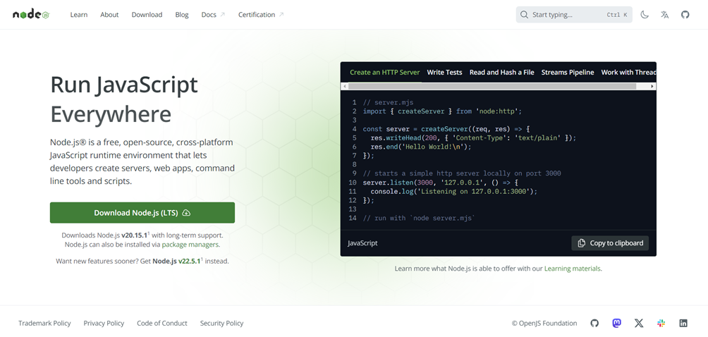

# Puppeteer
## Quick Guide

Puppeteer is a Node.js library that allows testers to perform headless (no visible UI) browser testing of Google Chrome. Puppeteer testing allows the tester to perform actions such as clicking links, filling out forms, and submitting buttons using JavaScript commands. It also offers high-level APIs for performing automated tests, developing and debugging website features, inspecting elements on a page, and profiling performance.
## Step 1. Install Node.js
To install Node.js, go to the official Node.js website - [here](https://nodejs.org/en) and download the latest version or the previous version of Node.js according to your operating system (Windows, Linux / Unix, Mac and OS X) you are going to use:

## Step 2. Create project structure
Create a new project using the ``npm init`` command to initialize a new project, or switch to an existing one.
## Step 3. Install Puppeteer
```bash
npm i puppeteer
```
## Step 4. Create tests
First, create a new file ``test.js``:
```javascript showLineNumbers
const puppeteer = require("puppeteer");

const searchButton = "#search>button";
const title = "#content>h1";

(async () => {
    // Launch the browser and open a new blank page
    // Headless Execution
    const browser = await puppeteer.launch({args: ['--no-sandbox', '--disable-setuid-sandbox']});
    // Non Headless Execution
    // const browser = await puppeteer.launch({headless:false});
    const page = await browser.newPage();

    // Navigate the page to a URL
    await page.goto("https://demo.opencart.com/",{waitUntil: 'networkidle0'});

    // Set screen size
    await page.setViewport({ width: 1080, height: 1024 });

    // Type into search box
    await page.type('[name="search"]', "Macbook");

    // Wait and click on search button
    // await page.waitForSelector(searchButton);
    await page.click(searchButton);
    await page.waitForSelector(title);
    await page.screenshot({
        path: 'testScreenshot.png'
     });
    await page.pdf({
        path: 'testPDF.pdf',
        margin: { top: '100px', right: '50px', bottom: '100px', left: '50px' },
        printBackground: true,
        format: 'A4',
    });
    //To reflect CSS used for screens instead of print
    await page.emulateMediaType('screen');
    await browser.close();
})();
```
* lines 1, 2 
